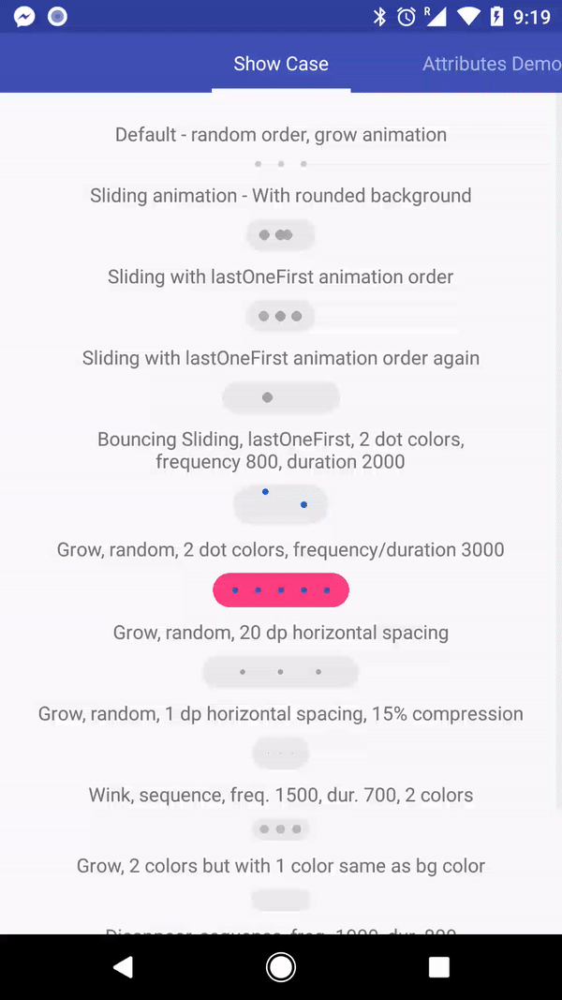
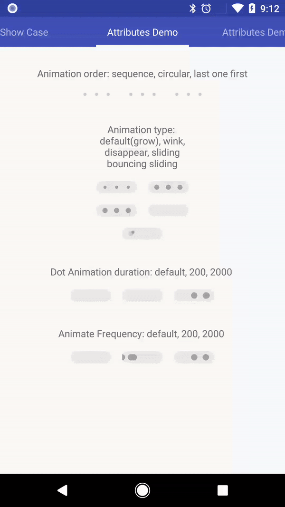
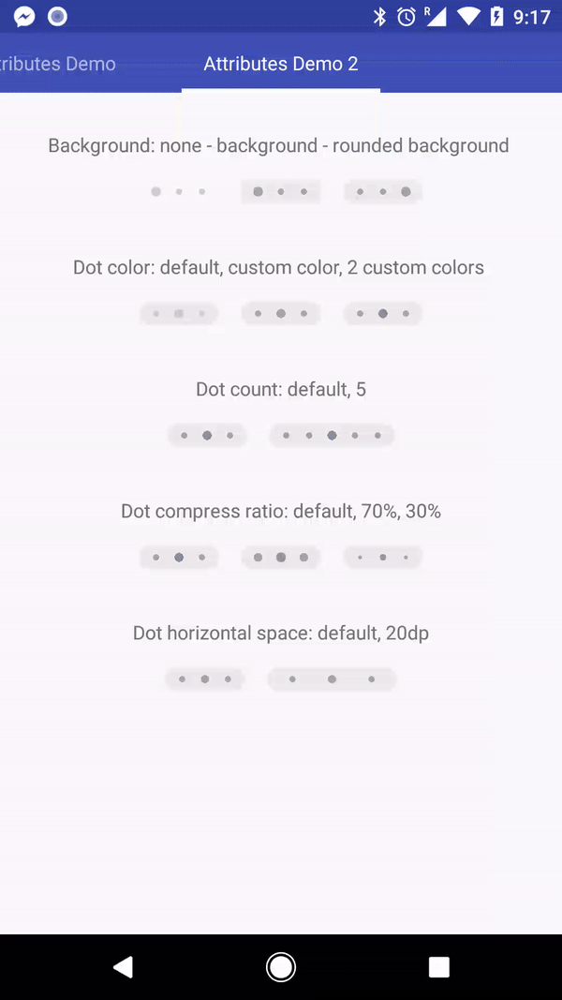

[](https://jitpack.io/#uDevel/widgetlab)

# Typing indicator or wait progress animation.

## Gif of Sample app:
  


## Video of Sample app:

[](http://www.youtube.com/watch?v=tNltD2vnbsw "Sample app")

## How to use:
Just put it in your xml layout.  It can't get any easier than that.
```xml
 <com.udevel.widgetlab.TypingIndicatorView
            android:layout_width="wrap_content"
            android:layout_height="wrap_content"/>
```
This gives you the default.  There are many optional [configurations](https://github.com/uDevel/widgetlab/wiki/Configurations) available.  This is recommended if you want to have unique animation; there are examples that you can modify from.

Ex. BouncingSliding animation type:    


## Gradle:
Add to your project level build.gradle's allprojects
```xml
allprojects {
  repositories {
    ...
    maven { url 'https://jitpack.io' }
  }
}
```

Next add to your module level (app) build.gradle's dependencies block like this
```xml
dependencies {
          compile 'com.github.uDevel:widgetlab:0.9.2'
}
```

Lastest version   
[](https://jitpack.io/#uDevel/widgetlab)
## Todos:
- Optimizing gc.
- More animation type.
